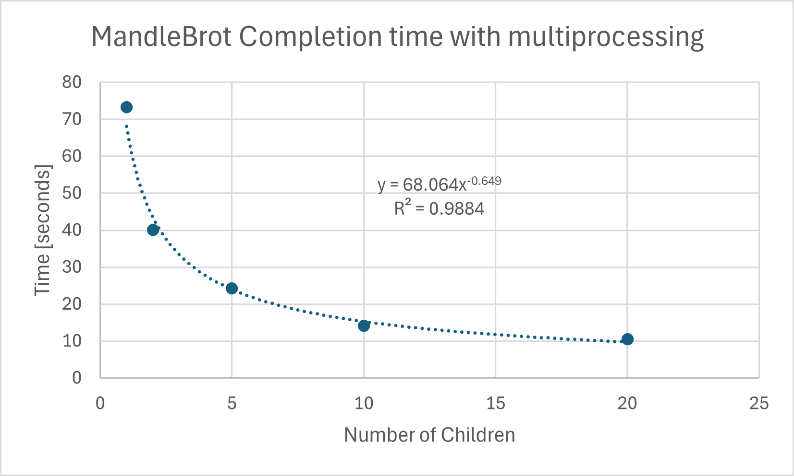
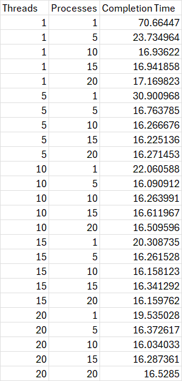

# System Programming Lab 11 Multiprocessing

This project implements mandelmovie, a multiprocessing program that launches multiple child processes to generate Mandelbrot-set images. The program accepts a -p option using getopt to choose the number of child processes. Each child independently invokes the mandel program to generate one frame. Frames are zoomed by decreasing scale each iteration. After generation, ffmpeg was used to assemble a movie.

Below is the plot of # of processes vs total runtime:

Overall, the exponential decay trend shows that adding more processes increases performance quickly, but the benefit drops off once CPU cores become saturated, resulting in diminishing returns.

# System Programming Lab 12 Multithreading

This project adds support for multiple threads and multiple processes to mandelmovie. The -t option selects the number of threads used for computing each frame, and the -p option selects how many child processes are created. Each process generates a single frame, and each thread helps compute pixels within those frames.

Discussion

1. Which technique impacted runtime more?
Multiprocessing had the larger effect on reducing runtime. Creating more processes lets the program use more CPU cores directly, so it scales better than threads, which must share resources inside a single process.

2. Was there a “sweet spot”?
Yes. Runtimes settle around 16 seconds once both threads and processes are between 5 and 10. Beyond that point, adding more of either does not improve performance because all CPU cores are already fully utilized.

Below is the table of runtimes for a variety of combinations
## Benchmark Table

